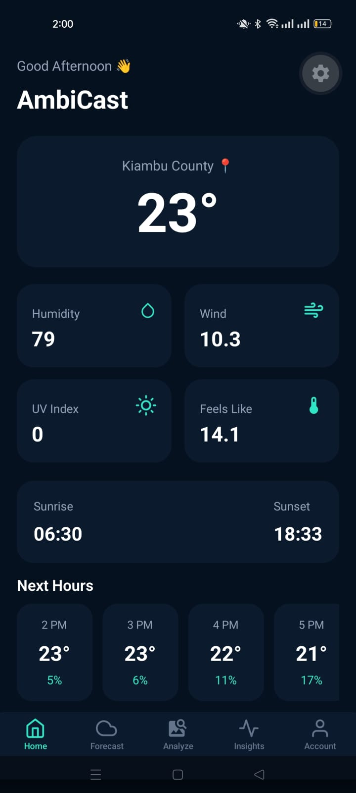
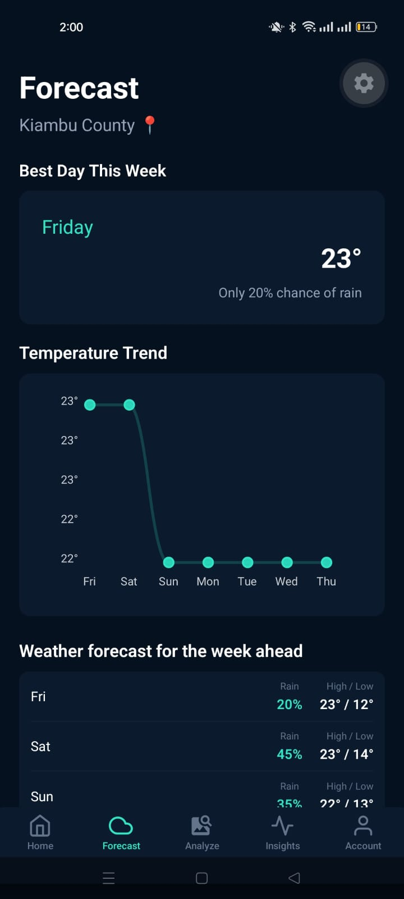
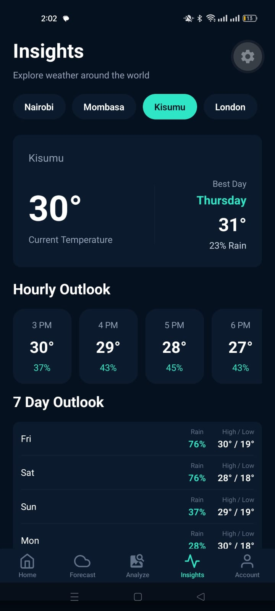
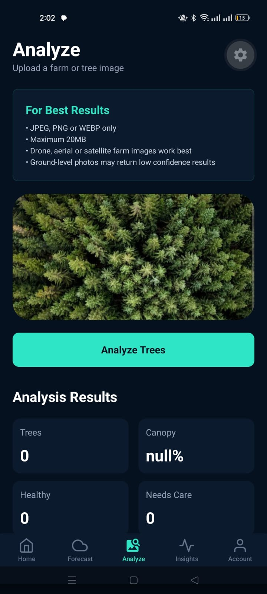
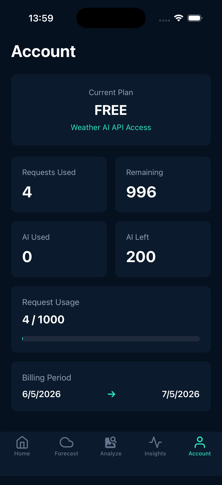

# AmbiCast 🌦️

A modern weather intelligence mobile application built with Expo, React Native, TypeScript, and the Weather AI API.

## Overview

AmbiCast helps users:

- View current weather conditions
- Explore 7-day forecasts
- Compare weather across global cities
- Analyze aerial farm imagery using AI
- Monitor API usage and account limits

---

## Screenshots

## Screenshots

<p align="center">
  
  
  
</p>

<p align="center">
  
  
  
</p>


---

## Features

### 🏠 Home

- Current temperature
- Humidity
- Wind speed
- UV index
- Feels-like temperature
- Sunrise and sunset times
- Hourly weather outlook

### 📈 Forecast

- Weekly forecast
- Temperature trend chart
- Best day recommendation

### 🌍 Insights

Explore weather conditions for:

- Nairobi
- Mombasa
- Kisumu
- Cape Town
- Dubai
- London

Includes:

- Current temperature
- Best day to visit
- Hourly outlook
- 7-day forecast

### 🌳 Analyze

Upload drone, aerial, or satellite imagery to receive:

- Tree count estimation
- Health analysis
- Canopy coverage
- Confidence score
- AI recommendations

Supported formats:

- JPEG
- PNG
- WEBP

Maximum upload size:

- 20 MB

### 👤 Account

- API plan information
- Request usage
- AI request usage
- Remaining quota
- Billing period information

---

## Tech Stack

- React Native
- Expo
- TypeScript
- Expo Router
- Zustand
- Weather AI API
- React Native Chart Kit

---

## Project Structure

```text
src/
├── app/
│   └── (tabs)/
│       ├── home.tsx
│       ├── forecast.tsx
│       ├── insights.tsx
│       ├── analyze.tsx
│       └── account.tsx
│
├── services/
├── store/
├── types/
├── constants/
└── components/
```

---

## State Management

### Zustand

The application uses Zustand for lightweight global state management.

#### Location Store

Stores:

- Latitude
- Longitude
- City

This prevents requesting device location repeatedly across screens.

#### Weather Store

Stores:

- Weather data
- Last fetch timestamp

Benefits:

- Reduces API calls
- Improves performance
- Helps preserve API quota
- Enables data sharing between tabs

---

## API Optimization

To reduce unnecessary API usage:

- Weather responses are cached in Zustand
- Screens reuse shared weather data
- Forecast uses cached data instead of making duplicate requests
- Location information is stored globally

---

## Environment Variables

Create a `.env` file:

```env
EXPO_PUBLIC_BASE_URL=https://api.weather-ai.co
EXPO_PUBLIC_WEATHER_API_KEY=your_api_key
```

---

## Installation

Install dependencies:

```bash
npm install
```

Start Expo:

```bash
npx expo start
```

---

## Notes

### iOS Simulator

When running on an Apple iOS Simulator, location services may default to **San Francisco** if a custom simulator location has not been configured.

The application works correctly on physical devices and on simulators configured with a custom location.

### Tree Analysis

Best results are obtained using:

- Drone imagery
- Aerial imagery
- Satellite imagery

Ground-level photographs may result in low-confidence analysis.

---

## Future Improvements

- Search for any city worldwide
- Offline weather caching
- Weather alerts
- Saved locations
- Historical weather analytics
- Enhanced farm intelligence reports

---

## Author

**Rose Wachuka**

Built as a Weather AI mobile application assessment using React Native, Expo, and TypeScript.